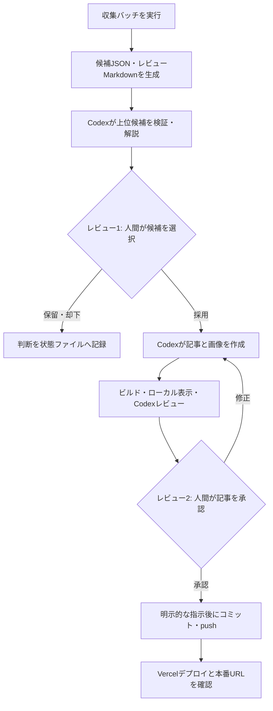

# ゲーム最新情報収集バッチ 詳細設計

## 1. 目的

ゲーム関連の公式一次情報を定期的に収集し、記事化候補を機械的に絞り込んだうえで、Codexと人間がレビューできる候補一覧を生成する。

本バッチは記事を自動公開しない。公開までには、次の2回の人間レビューを必須とする。

1. 記事候補の採用判断
2. 作成された記事の内容・表示・公開可否の判断

初期段階ではCodexデスクトップアプリのチャットからローカル実行する。運用が安定した後、同じコマンドをCodex Automationから定期実行できる構成にする。

## 2. 対象範囲

### 2.1 初期リリースに含めるもの

- 登録済み公式情報源からのRSS 2.0／Atom取得
- 登録済み公式サイトマップからの新規URL検出
- URL単位の差分取得
- 取得結果の共通形式への正規化
- 公開済み記事と過去候補を使った重複判定
- ルールベースのスコアリング
- JSON形式の候補データとMarkdown形式のレビューレポート生成
- Codexが上位候補を追加確認するための入力データ生成
- 採用、保留、却下という人間の判断結果の記録
- dry-runと詳細ログ

### 2.2 初期リリースに含めないもの

- X APIからの自動収集
- 任意のWeb検索結果からの収集
- JavaScriptレンダリングが必要なページのブラウザ操作
- LLMを使った全件収集・全件要約
- 記事の自動採用
- 記事の自動コミット、push、公開
- 画像の利用許諾の自動確定
- `backend` の変更

YouTubeは初期リリース後の拡張対象とする。追加する場合はキーワード検索ではなく、許可リストに登録した公式チャンネルの更新監視を基本とする。

## 3. 公開までのワークフロー



レビュー1の承認がない候補から記事ファイルを作成しない。レビュー2で記事が承認されても、コミットまたはpushの明示的な指示がなければGit操作を行わない。

## 4. 配置

バッチは公開サイトのソースコードと分離し、`frontend/tools/news-collector` 配下に配置する。

```text
frontend/
├── tools/news-collector/
│   ├── config/
│   │   ├── sources.json
│   │   └── scoring.json
│   ├── src/
│   │   ├── cli.ts
│   │   ├── commands/
│   │   │   ├── collect.ts
│   │   │   ├── report.ts
│   │   │   ├── status.ts
│   │   │   └── decide.ts
│   │   ├── collectors/
│   │   │   ├── rss.ts
│   │   │   └── sitemap.ts
│   │   ├── pipeline/
│   │   │   ├── normalize.ts
│   │   │   ├── deduplicate.ts
│   │   │   ├── score.ts
│   │   │   └── rank.ts
│   │   ├── repositories/
│   │   │   ├── candidate-repository.ts
│   │   │   └── article-repository.ts
│   │   ├── reporting/
│   │   │   ├── markdown.ts
│   │   │   └── ai-review-input.ts
│   │   └── types.ts
│   └── tests/
└── .news-collector/
    ├── state.json
    ├── candidates.json
    ├── decisions.json
    ├── cache/
    ├── reports/
    └── runs/
```

`tools/news-collector/config` とソースコードはGit管理対象とする。`.news-collector` は取得した本文、実行状態、判断履歴、生成レポートを含むローカル実行データであり、初期段階では `.gitignore` の対象とする。

Automationへ移行する際は、`.news-collector` の代わりとなる永続ストレージを別途決定する。GitHub Actionsの一時キャッシュだけを正式な状態保存先にはしない。

## 5. コマンドインターフェース

`frontend/package.json` に次のコマンドを追加する想定とする。

```json
{
  "scripts": {
    "news:collect": "tsx tools/news-collector/src/cli.ts collect",
    "news:report": "tsx tools/news-collector/src/cli.ts report",
    "news:status": "tsx tools/news-collector/src/cli.ts status",
    "news:decide": "tsx tools/news-collector/src/cli.ts decide"
  }
}
```

### 5.1 `pnpm news:collect`

情報取得、正規化、重複判定、採点、レポート生成を一括実行する標準コマンド。

```bash
pnpm news:collect
pnpm news:collect -- --dry-run
pnpm news:collect -- --source sega-topics
pnpm news:collect -- --since 2026-08-03T00:00:00+09:00
pnpm news:collect -- --limit 20
```

- `--dry-run`: 永続状態と判断履歴を変更しない
- `--source`: 指定した情報源だけを取得する
- `--since`: 通常の差分位置を使わず指定日時以降を対象にする
- `--limit`: レポートに出す候補数の上限。取得件数の上限ではない

終了コードは、成功を0、部分成功を2、全情報源失敗または設定異常を1とする。部分成功でも利用可能な候補とレポートは生成する。

### 5.2 `pnpm news:report`

保存済み候補からレポートを再生成する。外部通信は行わない。

```bash
pnpm news:report
pnpm news:report -- --status new,reviewing
pnpm news:report -- --top 10
```

### 5.3 `pnpm news:status`

情報源ごとの最終成功日時、未レビュー候補数、失敗情報源、直近実行の概要を表示する。

### 5.4 `pnpm news:decide`

人間の判断を記録する。初期実装では、人間の依頼を受けたCodexが実行する。

```bash
pnpm news:decide -- 20260804-sega-abc accepted --note "記事化を承認"
pnpm news:decide -- 20260804-sega-def held --note "国内発表を待つ"
pnpm news:decide -- 20260804-sega-ghi rejected --note "既存記事と重複"
```

判断状態は `new`、`reviewing`、`accepted`、`held`、`rejected`、`published` とする。`accepted` への変更だけでは記事生成を自動開始しない。

## 6. 情報源設定

情報源は許可リスト方式で管理する。任意URLや検索エンジン結果を自動巡回しない。

```json
{
  "schemaVersion": 1,
  "sources": [
    {
      "id": "publisher-news",
      "name": "パブリッシャー公式ニュース",
      "publisher": "Publisher Name",
      "type": "rss",
      "url": "https://example.com/news/feed.xml",
      "enabled": true,
      "official": true,
      "locale": "ja-JP",
      "defaultCategories": ["業界ニュース"],
      "includePatterns": ["/news/", "/topics/"],
      "excludePatterns": ["/goods/", "/support/"],
      "requestIntervalMs": 1000,
      "timeoutMs": 15000
    }
  ]
}
```

### 6.1 必須検証

- `id` が一意である
- `url` がHTTPSである
- `type` が実装済みコレクターである
- `defaultCategories` がサイト既存のカテゴリ名だけで構成される
- `official` が明示される
- タイムアウトとアクセス間隔が安全な範囲内である

設定異常は取得開始前に検出し、全体を失敗させる。

## 7. データモデル

### 7.1 生取得アイテム

```ts
interface RawNewsItem {
  sourceId: string;
  externalId?: string;
  url: string;
  title?: string;
  summary?: string;
  publishedAt?: string;
  updatedAt?: string;
  fetchedAt: string;
  rawPayloadPath?: string;
}
```

### 7.2 正規化済み候補

```ts
type CandidateStatus =
  | 'new'
  | 'reviewing'
  | 'accepted'
  | 'held'
  | 'rejected'
  | 'published';

interface NewsCandidate {
  schemaVersion: 1;
  candidateId: string;
  fingerprint: string;
  sourceId: string;
  sourceType: 'rss' | 'atom' | 'sitemap' | 'youtube';
  sourceUrl: string;
  canonicalUrl: string;
  externalId?: string;

  title: string;
  summary?: string;
  publisher: string;
  official: boolean;
  locale?: string;
  announcedAt?: string;
  discoveredAt: string;
  lastSeenAt: string;

  gameTitles: string[];
  platforms: string[];
  suggestedCategories: string[];
  suggestedTags: string[];
  matchedKeywords: string[];

  score: number;
  scoreBreakdown: ScoreBreakdown;
  warnings: CandidateWarning[];
  duplicate: DuplicateAssessment;
  imageAssessment: ImageAssessment;

  status: CandidateStatus;
  decision?: CandidateDecision;
}
```

`gameTitles`、`platforms`、`suggestedTags` は初期版では辞書と正規表現による推定値とし、確定情報として記事へ転記しない。

### 7.3 判断履歴

```ts
interface CandidateDecision {
  status: Exclude<CandidateStatus, 'new'>;
  decidedAt: string;
  decidedBy: 'human-via-codex';
  note: string;
}
```

状態の上書きだけでなく、`decisions.json` にイベント履歴を追記する。後から保留解除や誤判定の経緯を確認できるようにする。

## 8. 収集処理

### 8.1 共通HTTP処理

- HTTPSのみ許可する
- 明示的なUser-Agentを送信する
- 情報源単位のタイムアウトを適用する
- `ETag` と `Last-Modified` を保存し、条件付きGETを使用する
- HTTP 304は正常終了として扱う
- HTTP 429と5xxは指数バックオフ付きで最大3回再試行する
- 4xxは原則再試行しない
- レスポンスサイズに上限を設ける
- Content-Typeが想定と異なる場合は警告または失敗にする
- リダイレクト後も許可されたHTTPS URLか確認する
- ローカルアドレスやプライベートネットワークへの接続を拒否する

### 8.2 RSS／Atom

- GUIDがあれば `externalId` に使う
- linkをcanonical URL候補にする
- title、description／summary、published／updatedを抽出する
- HTMLを含む要約はタグを除去して文字数を制限する
- 日付がない項目も候補化できるが、警告と鮮度減点を付ける

### 8.3 サイトマップ

- `<loc>` と `<lastmod>` を抽出する
- include／excludeパターンを適用する
- 前回確認済みURLとlastmodが変わらない項目は本文取得しない
- 新規または更新URLのHTMLからtitle、description、公開日時を抽出する
- HTML本文抽出は共通メタデータを優先し、必要になった場合だけ情報源別アダプターを追加する

サイトマップのlastmodは情報源によって信頼性が異なるため、URLの新規性を主判定、lastmodを補助判定として使用する。

## 9. 正規化

以下を決定的な処理として実装し、同じ入力から同じ結果を得られるようにする。

- URLフラグメントを削除
- 既知のトラッキングクエリを削除
-ホスト名を小文字化
- 末尾スラッシュを情報源ルールに従って統一
- HTMLエンティティを復号
- UnicodeをNFKC正規化
- 連続空白を単一空白へ変換
- 全角・半角の差を重複判定用文字列では吸収
- 日時をISO 8601へ変換し、表示時だけAsia/Tokyoへ変換
- プラットフォーム表記を `PlayStation`、`Switch`、`PC`、`モバイル`、`Xbox`、`VR` の既知語へ対応付け

元タイトルと元URLは失わず保存する。

## 10. 重複判定

### 10.1 確定重複

次のいずれかに一致した候補は、新規レビュー対象から除外する。

1. canonical URLが既存候補と一致
2. `sourceId + externalId` が一致
3. fingerprintが一致
4. 公開済み記事本文に同じ公式URLが含まれる
5. 既に `published` と関連付けられた候補である

fingerprintは、`sourceId + 正規化URL` を基本としてSHA-256で生成する。タイトルだけをfingerprintに使わない。

### 10.2 類似候補

次は自動除外せず、警告と減点を付けて人間またはCodexへ提示する。

- 正規化タイトルの類似度が高い
- 同じゲーム名、発表元、24時間以内の発表
- 同じYouTube動画URLを参照している
- 同じ日付・発売日・バージョン番号を含む

「発売日決定」と「発売延期」などを誤って統合しないため、類似候補の自動マージは初期版では行わない。

### 10.3 公開済み記事との照合

`frontend/src/data/articles/index.ts` から到達可能な記事を基準とし、以下を抽出する。

- slug、id、title、publishedAt
- content内の外部リンク
- tags、categories

記事TSファイルの単純なファイル名一覧だけではなく、サイトが実際に参照する `allArticles` を基準にする。ただし、バッチからNext.jsコードを安全にimportできない場合に備え、TypeScript ASTまたは限定的な読み取り処理を採用する。

## 11. スコアリング

スコアは0～100へ丸める。掲載可否を決める値ではなく、レビュー順を決める補助値とする。配点は `scoring.json` で変更可能にする。

### 11.1 基本配点

| 区分 | 条件 | 点数 |
| --- | --- | ---: |
| 信頼性 | 公式プレスリリース | +25 |
| 信頼性 | メーカー／ゲーム公式サイト | +23 |
| 信頼性 | 公式YouTube／公式ストア | +20 |
| 鮮度 | 6時間以内 | +15 |
| 鮮度 | 24時間以内 | +12 |
| 鮮度 | 3日以内 | +7 |
| 鮮度 | 7日以内 | +3 |
| ニュース価値 | 完全新作・正式発表 | +20 |
| ニュース価値 | 発売日・配信日決定 | +15 |
| ニュース価値 | 大型DLC・大型アップデート | +12 |
| ニュース価値 | サービス開始・終了 | +10 |
| ニュース価値 | 対応機種追加 | +8 |
| サイト適合 | 日本語／日本向け発表 | +5 |
| サイト適合 | 既存カテゴリへ分類可能 | +5 |
| サイト適合 | 複数プラットフォーム | +3 |
| 減点 | 類似する公開済み記事 | -30 |
| 減点 | 情報量が少ない | -10 |
| 減点 | 日本向け適用が不明 | -5 |
| 減点 | グッズ・セール中心 | -15 |

同じ区分内の鮮度点は重複加算せず、該当する最大値だけを加える。ニュース価値は複数該当を許すが、区分上限を30点とする。

### 11.2 除外条件

- 許可リスト外の情報源
- 一次情報であることを確認できない
- 7日より古く、更新情報もない
- サポートFAQや障害情報だけで記事性がない
- 利用規約、採用情報、IR資料など、ゲームニュース対象外のURL
- canonical URLによる確定重複

除外理由は記録し、件数だけを実行サマリーへ表示する。調査可能性のため、除外データは設定した保持期間まではローカル状態に保存する。

### 11.3 画像の扱い

画像URLの存在はスコアへ加点しない。次の状態だけを記録する。

- `permitted`: 利用条件と根拠URLを人間が確認済み
- `unknown`: 画像は存在するが利用条件未確認
- `embed-only`: 埋め込みのみ利用可能
- `unavailable`: 利用候補なし
- `prohibited`: 利用不可

バッチが自動取得した画像は、レビュー1およびレビュー2を通過するまで記事ディレクトリへコピーしない。

## 12. レビュー用出力

### 12.1 Markdownレポート

レポートには次を表示する。

- 実行日時、対象期間、成功／失敗情報源数
- 新規候補、類似候補、除外候補の件数
- スコア順の候補一覧
- 各候補のcandidate ID
- タイトル、発表元、発表日時、公式URL
- 短い機械抽出要約
- スコア内訳
- 推奨カテゴリ・タグ
- 重複可能性
- 画像利用条件の状態
- Codexが確認すべき論点
- 取得失敗やデータ不足の警告

候補一覧の「記事化推奨理由」は、バッチ段階ではルールに基づく定型文とする。ニュースの意味を踏まえた推奨理由はCodexレビューで補完する。

### 12.2 AIレビュー入力

Codexへ渡すデータは、既定で次の条件に絞る。

- `status` が `new` または `reviewing`
- スコア上位10件
- 確定重複ではない
- タイトル、要約、公式URL、採点内訳、警告
- 必要な本文抜粋は候補ごとに上限を設ける

全文HTML、ナビゲーション、フッター、Cookie表示などは含めない。新規候補が0件の場合はAIレビューを実行しない。

## 13. Codexレビュー仕様

バッチ実行後、Codexは上位候補について公式ページを確認し、次を人間へ提示する。

- 記事化推奨順位
- バッチスコアと、必要ならCodexによる補正意見
- 発表内容の要点
- ゲームニュースとしての重要性
- 国内読者への関連性
- 既存記事との重複または続報関係
- 事実確認で注意すべき事項
- 使用可能な公式画像または埋め込みの有無
- 「採用」「保留」「見送り」の推奨

Codexはバッチスコア自体を書き換えず、判断が異なる場合は理由を併記する。これによりルール評価とAI評価を分離して検証できる。

## 14. 記事作成への引き渡し

人間が候補を承認した後、Codexは候補データを入力として既存の `docs/article-publishing.md` に従う。

引き渡しデータには次を含める。

- candidate ID
- 承認時の人間コメント
- 採用する公式URL
- 事実として使用可能な発表内容
- 未確認事項
- 推奨カテゴリ・タグ
- 画像利用条件と根拠URL

記事作成後も候補データは `accepted` のままとし、本番公開が確認された時点でのみ `published` と記事slugを記録する。

## 15. ローカル記事レビュー

記事作成後のCodexレビューでは、最低限次を実施する。

1. 記事TS、画像、月別index、全記事indexの差分確認
2. 公式一次情報との事実照合
3. タイトル、要約、本文の整合性確認
4. 日付、価格、機種、固有名詞の確認
5. 画像利用条件または非公式イメージ表記の確認
6. 外部リンク、YouTube、X埋め込みの確認
7. `pnpm build` の成功確認
8. `popularArticles.json` の生成差分確認
9. `pnpm dev` で対象記事をローカル表示
10. 詳細、トップ、カテゴリ、タグ、検索、関連記事の表示確認

CodexはローカルURL、変更ファイル、検証結果、残っている警告を人間へ提示する。人間が記事を承認しても、コミット・pushは別の明示的な指示を必要とする。

## 16. 状態管理

### 16.1 `state.json`

情報源ごとに次を保持する。

- 最終試行日時
- 最終成功日時
- ETag
- Last-Modified
- 最後に確認したURLまたは日時
- 連続失敗回数
- 直近エラー種別

状態ファイルは一時ファイルへ書き、fsync後にrenameすることで、途中終了による破損を防ぐ。実行開始時にはロックファイルを作成し、同じ作業ディレクトリでの多重実行を拒否する。

### 16.2 保持期間

- 採用・公開候補：期限なし
- 却下候補：180日
- 確定重複：90日
- 生レスポンスキャッシュ：14日
- 実行ログ：30日

保持期間を過ぎても、公開済み記事とのURL照合は常に行う。

## 17. ログと実行サマリー

ログは人間向けテキストと機械可読JSON Linesを想定する。次の値を記録する。

- run ID
- 開始・終了日時と所要時間
- 情報源ごとのHTTP結果
- 取得、更新、重複、除外、候補化件数
- リトライ回数
- エラー種別
- 生成したレポートパス

APIキー、Authorizationヘッダー、Cookie、レスポンス全文はログへ出さない。

## 18. エラー処理

| 状況 | 動作 |
| --- | --- |
| 1情報源がタイムアウト | 再試行後、その情報源だけ失敗として継続 |
| HTTP 304 | 更新なしとして正常終了 |
| HTTP 429 | Retry-Afterを尊重して再試行 |
| XML解析失敗 | 生データを期限付き保存し、その情報源を失敗扱い |
| HTML構造変更 | メタデータ不足警告を出し、誤った候補を作らない |
| 状態ファイル破損 | バックアップから復旧。できなければdry-run相当で停止 |
| 候補保存失敗 | 状態位置を進めず全体を失敗扱い |
| 一部情報源失敗 | 部分成功としてレポートに明記 |
| 全情報源失敗 | 終了コード1、既存候補は変更しない |

取得失敗を「新規情報なし」として扱わない。

## 19. セキュリティと権利

- 情報源はGit管理された許可リストだけを使用する
- URLを使う前にプロトコル、ホスト、解決先を検証する
- シークレットは環境変数で受け取り、設定ファイルへ保存しない
- `.env` と値をコミットしない
- robots.txt、利用規約、レート制限を確認する
- 記事本文や画像を転載目的で保存しない
- 候補レポートには必要最小限の要約と公式URLを記録する
- 画像利用可否は人間が根拠を確認する
- 公式ページの文言を長文でそのまま記事へ転用しない

## 20. テスト設計

### 20.1 単体テスト

- URL正規化
- 日時変換とタイムゾーン
- RSS／Atom解析
- サイトマップ解析
- include／exclude判定
- fingerprint生成
- 確定重複と類似候補判定
- キーワード検出
- 配点上限と0～100丸め
- 状態遷移
- Markdownエスケープ

### 20.2 結合テスト

外部通信は固定fixtureを使って再現する。

- 初回取得で候補が生成される
- 同じフィードの再取得で候補が増えない
- ETag／304で本文処理を省略する
- 1情報源失敗でも他の候補が生成される
- 公開済み記事の公式URLと一致して除外される
- 設定変更後も既存の判断履歴が維持される
- dry-runで永続ファイルが変わらない

### 20.3 受け入れ条件

- 同じ入力を2回実行して候補が重複しない
- 上位候補の採点内訳を人間が説明可能である
- 取得失敗と新着なしを区別できる
- 候補0件ではAIレビューが不要と判断できる
- 未承認候補から記事ファイルが作られない
- バッチ実行だけでは `main`、記事データ、画像、`popularArticles.json` が変更されない
- シークレットがログと成果物へ含まれない

## 21. 依存関係

実装時は、必要最小限の依存関係を `frontend/package.json` と `pnpm-lock.yaml` に追加する。

- TypeScript CLI実行環境
- RSS／Atom／XMLパーサー
- HTMLメタデータ抽出ライブラリ
- 設定・永続データのスキーマ検証
- テストランナー

依存ライブラリは実装開始時に保守状況、ライセンス、Node.js 20対応、既知の脆弱性を確認して選定する。ロックファイルを更新し、最終的に `pnpm build` を成功させる。

## 22. 実装フェーズ

### Phase 1: ローカルMVP

- CLI基盤
- JSON設定検証
- RSS／Atom取得
- ローカル状態保存
- URL重複排除
- 基本スコアリング
- Markdownレポート
- dry-run
- fixtureベースのテスト

### Phase 2: 実用化

- サイトマップ取得
- 公開済み記事とのURL照合
- 類似候補判定
- 判断履歴と状態遷移
- Codexレビュー入力の最適化
- 失敗監視と保持期間処理

### Phase 3: 取得先拡張

- 公式YouTubeチャンネル
- 必要な情報源だけのHTMLアダプター
- ゲーム名・プラットフォーム辞書の拡充
- 運用実績に基づく配点調整

### Phase 4: Codex Automation

- 定期実行
- 永続ストレージ
- 新規候補がある場合だけタスクを起動
- 実行失敗通知
- 手動実行との排他制御

Automation移行後も、候補採用と記事公開の2回の人間レビューは省略しない。

## 23. 初期運用指標

最初の2～4週間は次を記録し、スコアと対象情報源を調整する。

- 取得した新規項目数
- 候補化率
- AIレビュー対象数
- 人間による採用、保留、却下率
- 重複見逃し数
- 有力候補の取りこぼし数
- 情報源ごとの採用貢献数
- 1回の処理時間
- 取得失敗率
- AIへ渡した件数と本文量

目標は取得件数を増やすことではなく、人間が短時間で有力な一次情報を選べることとする。

## 24. 実装開始時に確定する事項

以下は設計上の拡張点として残し、MVP実装開始時に初期値を確定する。

1. 最初に登録する公式情報源10～20件
2. 候補レポートの既定件数
3. AIレビューに回す最低スコア
4. ローカル状態を将来もGit管理外にするか
5. 採点辞書へ含めるゲーム固有語
6. Automationで使用する永続ストレージ

これらはパイプラインの構造を変更せず、設定またはRepository実装の差し替えで変更できるものとする。

具体的な公式情報源、URL、優先度、情報源固有のフィルターは `docs/news-source-catalog.md` を参照する。
